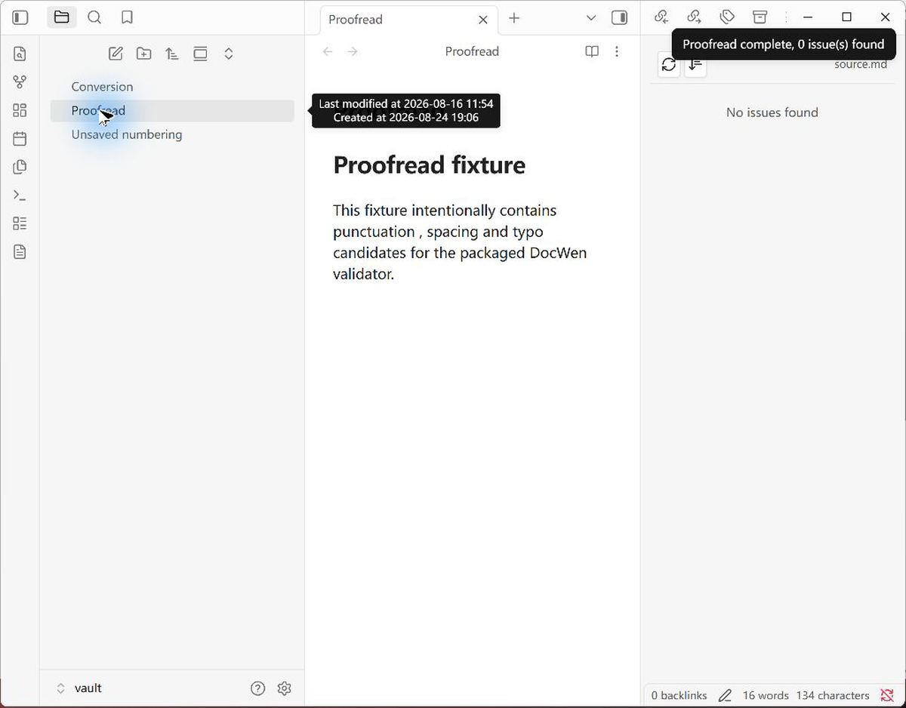
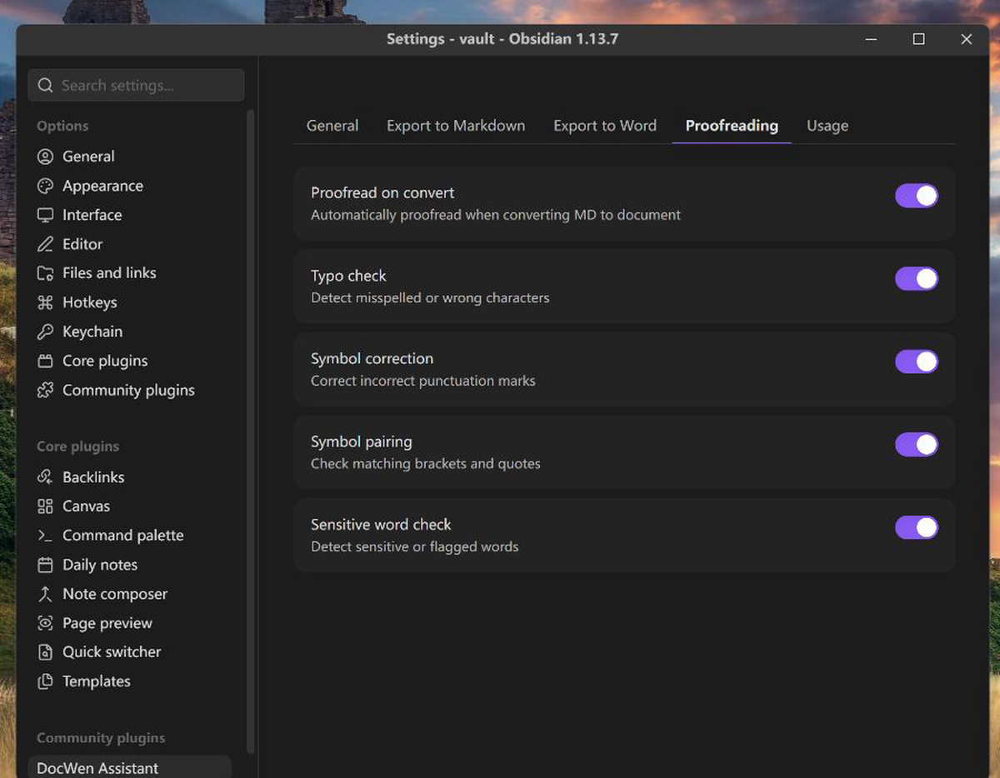
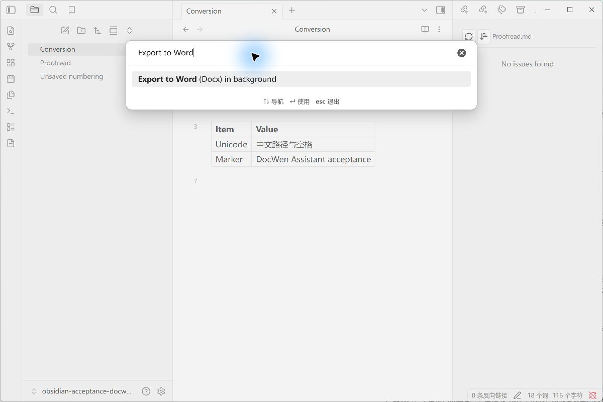

# DocWen Assistant

[English](https://github.com/ZHYX91/obsidian-docwen-assistant/blob/main/README.md) · [简体中文](https://github.com/ZHYX91/obsidian-docwen-assistant/blob/main/docs/i18n/README.zh-CN.md) · [繁體中文](https://github.com/ZHYX91/obsidian-docwen-assistant/blob/main/docs/i18n/README.zh-TW.md) · [Deutsch](https://github.com/ZHYX91/obsidian-docwen-assistant/blob/main/docs/i18n/README.de-DE.md) · [Français](https://github.com/ZHYX91/obsidian-docwen-assistant/blob/main/docs/i18n/README.fr-FR.md) · [Русский](https://github.com/ZHYX91/obsidian-docwen-assistant/blob/main/docs/i18n/README.ru-RU.md) · [Português](https://github.com/ZHYX91/obsidian-docwen-assistant/blob/main/docs/i18n/README.pt-BR.md) · [日本語](https://github.com/ZHYX91/obsidian-docwen-assistant/blob/main/docs/i18n/README.ja-JP.md) · [Español](https://github.com/ZHYX91/obsidian-docwen-assistant/blob/main/docs/i18n/README.es-ES.md) · [한국어](https://github.com/ZHYX91/obsidian-docwen-assistant/blob/main/docs/i18n/README.ko-KR.md) · [Tiếng Việt](https://github.com/ZHYX91/obsidian-docwen-assistant/blob/main/docs/i18n/README.vi-VN.md)

DocWen Assistant relie Obsidian à une installation locale de [DocWen](https://github.com/ZHYX91/docwen). Il nécessite Windows, Obsidian 1.12.7 ou ultérieur et une version stable de DocWen 0.9.x.

> **DocWen est requis.** Installez une version compatible depuis [Microsoft Store](https://apps.microsoft.com/detail/9NR2211SJH97), ou extrayez entièrement le ZIP portable proposé dans [DocWen Releases](https://github.com/ZHYX91/docwen/releases).

## Captures d’écran

Ces captures montrent le plugin empaqueté avec DocWen CLI dans Obsidian pour ordinateur.

### Barre latérale de relecture

Examinez les problèmes par ligne ou par règle et revenez à la plage source correspondante sans réécrire la note.

### Paramètres à onglets supérieurs et capacités CLI

Utilisez les cinq onglets supérieurs pour choisir précisément l’environnement DocWen, régler les conversions et la relecture, puis vérifier les capacités Machine.

### Export selon les capacités

Choisissez une voie de conversion disponible et une destination explicite tout en laissant la note source inchangée.

## Fonctionnalités

Le plugin ouvre les fichiers dans DocWen, exporte vers Word/Excel/Markdown avec une destination explicite, gère la numérotation des titres Markdown, relit le Markdown et lance le diagnostic doctor.

## Configuration requise et compatibilité

- Windows et Obsidian 1.12.7 ou ultérieur ; le plugin fonctionne uniquement sur ordinateur.
- Un paquet Windows complet d'une version stable de DocWen 0.9.x, entièrement extrait ; le plugin ne télécharge pas DocWen automatiquement.
- Le plugin exige `docwen.machine.v1` et `docwen.artifact_bundle.v2` ; une version incompatible de DocWen est refusée au lieu d'utiliser un autre protocole.

La détection automatique utilise par défaut l’alias enregistré `docwen.exe` et reste valide après les mises à jour Microsoft Store. Pour le ZIP portable, passez à l’installation manuelle et choisissez le dossier DocWen extrait. Le plugin ne parcourt ni `WindowsApps` ni des dossiers arbitraires et ne télécharge aucun logiciel automatiquement.

## Installation

### Installer DocWen et le plugin

Installez DocWen depuis [Microsoft Store](https://apps.microsoft.com/detail/9NR2211SJH97) ou extrayez le ZIP portable depuis [DocWen Releases](https://github.com/ZHYX91/docwen/releases). Installez DocWen Assistant depuis Community Plugins ou copiez `main.js`, `manifest.json` et `styles.css` dans `<Vault>/.obsidian/plugins/docwen-assistant/`. La détection automatique ne demande aucun fichier ; pour le ZIP portable, choisissez l’installation manuelle et le dossier DocWen dans les paramètres.

### Sécurité de l’installation

Le paquet de publication contient uniquement `main.js`, `manifest.json` et `styles.css` ; il ne contient, ne remplace et ne supprime jamais `data.json`. Ne supprimez `data.json` que pour réinitialiser volontairement toutes les préférences.

## Utilisation

L'icône, le sous-menu **DocWen** et la palette de commandes permettent de lancer DocWen, d'exporter Word/Excel/Markdown, de modifier la numérotation des titres, de relire le Markdown et d'exécuter doctor. L'export en arrière-plan exige toujours un fichier de sortie explicitement choisi.

Lors de l'export du Markdown résolu vers DOCX, DocWen fournit un fichier adjacent `<document>.docwen`. Assistant le valide et le publie atomiquement avec le DOCX ; s'il manque, est endommagé ou lié de façon ambiguë, aucun des deux fichiers n'est publié. Déplacez-les ou sauvegardez-les toujours ensemble. Lors de la conversion inverse, un fichier compagnon absent ou non concordant désactive uniquement la restauration exacte ; la sémantique Markdown canonique authentifiée reste disponible.

Avec une version compatible de [Number Suite](https://github.com/ZHYX91/obsidian-number-suite), l'export Word conserve les numéros virtuels validés des titres et légendes ainsi que les références de la même note, sans ajouter ces numéros à la note Markdown.

## Paramètres

Obsidian 1.12.7 ou ultérieur utilise cinq onglets supérieurs à défilement horizontal : Général, Exporter en Markdown, Exporter vers Word, Relecture et Utilisation. Les onglets prennent en charge les flèches, y compris RTL, Début/Fin, le texte d'interface à 20 px et de grandes cibles tactiles. La langue suit Obsidian par défaut et peut être remplacée par l'une des 11 langues prises en charge.

## Limitations

- Uniquement sur ordinateur Windows avec une installation locale compatible de DocWen.
- Aucune recherche récursive en dehors du dossier ou du programme DocWen sélectionné.
- Une opération est refusée si la réponse CLI, l'instantané source, l'état de l'éditeur ou la cible ne peuvent pas être vérifiés en toute sécurité.

## Confidentialité et sécurité

Le plugin transmet uniquement un instantané isolé de l’éditeur courant ou du fichier du Vault à DocWen. Il n’accède aux fichiers hors du Vault que pour lancer l’alias DocWen enregistré ou l’application portable choisie manuellement, gérer les entrées temporaires et artefacts validés, puis écrire vers une destination explicitement choisie. Il n’ouvre ni n’enregistre le chemin versionné du paquet Microsoft Store, ne téléverse aucun document et ne parcourt pas tout le Vault. Détails : [CLI integration contract](https://github.com/ZHYX91/obsidian-docwen-assistant/blob/main/docs/cli-integration.md)

## Développement

Utilisez Node.js 24.19.0 et npm 11.17.0. Exécutez `npm ci`, `npm run check` et `npm run release`. Le code source se trouve sous `src/`, les tests sous `tests/` ; les fichiers générés dans `dist/` et `release/` ne sont pas du code source.

Documents stables : [Exigences produit](../product-requirements.en.md) · [Spécification UX](../ux-spec.en.md) · [Architecture](../architecture.en.md) · [Stratégie de test](../testing-strategy.en.md) · [Procédure de publication](../release.en.md)

Gouvernance du dépôt : [Journal des modifications](../../CHANGELOG.md) · [Contribuer](../../CONTRIBUTING.md) · [Sécurité](../../SECURITY.md)

## Assistance

- Utilisez [General](https://github.com/ZHYX91/obsidian-docwen-assistant/discussions/categories/general) pour les idées de flux de travail et les retours généraux.
- Utilisez [Q&A](https://github.com/ZHYX91/obsidian-docwen-assistant/discussions/categories/q-a) pour les questions d'utilisation et de configuration.
- Signalez les défauts reproductibles d'intégration Obsidian et les propositions concrètes via les [formulaires d'issue DocWen Assistant](https://github.com/ZHYX91/obsidian-docwen-assistant/issues/new/choose).
- Pour la conversion, l'OCR, la relecture ou le comportement CLI hors d'Obsidian, utilisez les [issues DocWen Core](https://github.com/ZHYX91/docwen/issues).
- Signalez les vulnérabilités en privé conformément à la [politique de sécurité](https://github.com/ZHYX91/obsidian-docwen-assistant/security/policy).

Avant toute publication, retirez le contenu privé des documents, les chemins de fichiers et de Vault, les journaux CLI, les emplacements d'exécutables et les identifiants.

## Licence

MIT © ZhengYX
